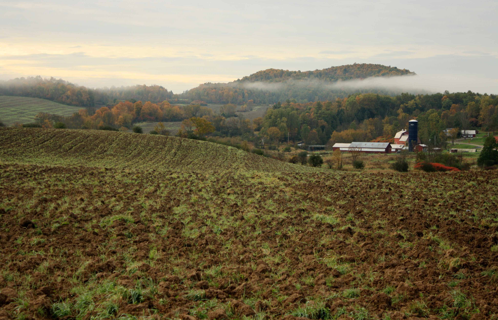
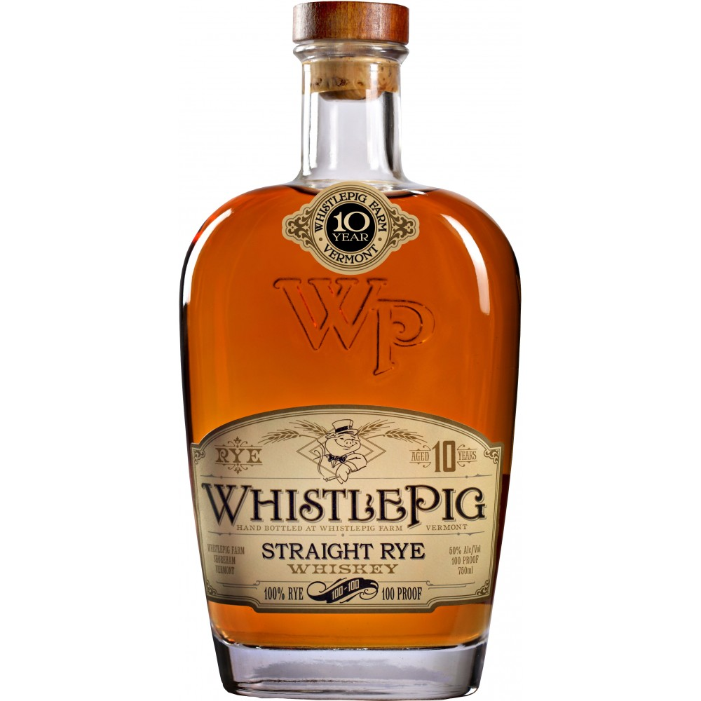

#### in the beginning ...

^ Get ready. Breath.

---

# [fit] Baghdad

^ • Baghdad was the center of learning and science in the 12th century

^ • Irish monks learn the arts of alchemy and distilling

^ • learned to distilling perfumes and elixers

^ • brought it back to Ireland to make drinkable spirit

---

# Uisce Beatha

^ • The monks called this new Elixer Uisce Beath, or Water of Life

^ • used to fight colic and smallpox

---

# around 1600

^ • about the time James was issuing a license to Old Bushmills

^ • Whiskey distilling is wide spread in both Ireland and Scottland

^ • England is also setting up shop in the new world in Jamestown, VA

---

# 1773

^ • Later, the locals decided to throw some tea into a harbor

^ • When they threw the tea into Boston Harbor, it wasn’t just throwing tea, it was throwing the British way of life, and that included rum, which had been the colonial drink. That didn’t mean they were going to quit drinking, it just meant they were going to switch to something made indigenously, and that was rye whiskey. - Dave Pickerell [1]

---

# 11,000 gallons

^ • At the time of his death in 1799, George Washington’s estate was the largest producer of whiskey in the country, turning out 11,000 gallons a year.

---

# In New Orleans

^ A few years later and 500 miles to the West; Scotch, Irish, and German immigrant farmers where producing and distributing Whiskey from excess corn and wheat harvests. Since trade was conducted by water, and the best market was New Orleans, their whiskey was loaded onto ships going south on the Ohio River from a port that is modern day Maysville, KY. To mark the whiskey's origin, the barrels were labelled "Old Bourbon".

---

# Alfred Bernard, 1885

^ When Alfred Barnard visited Ireland in 1885 researching for his book "The Whisky Distilleries of the United Kingdom", the number of legal distillers was 28. At the time, Irish Whisky was considered the finest in the world.

---

^ • Around the same time, phylloxera beetles were ruining French vineyards

^ • so entrepreneurial Scottish distillers took advantage

^ • replacing diminished brandy supplies with blended whisky

---

# 1919 - 1921

^ • Around 1920, the Irish lost their two biggest markets

^ • 1rst, America. Prohibition - 1920

^ • 2nd, England. Irish free state - 1919 - 1921

^ • This causes the collapse of Irish whiskey and there are only 3 distilleries in operation in 1966.

---

^ • England decides they'd rather drink Whisky loyal to the crown

^ • Quickly replace thier taste for Irish whiskey with Scotch

^ • And spread it through out "the Empire"

---

# [fit] Whiskey Explained
## with Nathan Stilwell
- @nathanstilwell
- Engineer @ Meetup, Inc

---

# What is Whiskey?

^ Whiskey is a distilled alcholic beverage made from a fermented grain mash aged in wooden barrels.

---

# [fit] whiskEy vs whisky

^ Ireland and the United States use the 'e', everybody else doesn't

---

# How to make Alcohol

^ Distillation ... volatile alcohol is seperated from less volatile elements by applying heat to beer or wine

^ The type of alcohol we drink is called ethonal

^ as opposed to say, isopropyl (rubbing alcohol)

---

# [fit] 173° ~ 212°

^ **Alcohol** ~ 173°F / 78.3°C

^ **Water** ~ 212°F / 100°C

---

# [fit] How to make Whiskey

---

# [fit] How to make Whiskey

1. Create a "Mash"

^ a mash is simply a combination of grains

---

# [fit] How to make Whiskey

1. Create a "Mash"
1. Let it turn into "Wort"

^ through a process called "mashing" we soak the grains in hot water to activate malt enzymes that convert grain starches into sugars.

^ This sugar rich solution is called a "wort" pronounced "wert"

---

# [fit] How to make Whiskey

1. Create a "Mash"
1. Let it turn into "Wort"
1. Add yeast, it becomes a "Wash"

^ we add yeast which eats the sugar and excretes ethanol and carbon dioxide.

^ This is called Fermentation and it usually stinks.

---

# [fit] How to make Whiskey

1. Create a "Mash"
1. Let it turn into "Wort"
1. Add yeast, it becomes a "Wash"
1. Strain into a Still

^ remove all the large solids, like husks and stuff

---

---

# [fit] How to make Whiskey

1. Create a "Mash"
1. Let it turn into "Wort"
1. Add yeast, it becomes a "Wash"
1. Strain into a Still
1. Distill to extract Ethanol

^ out comes our distillate, at this point it's moonshine

^ with differnt grains we would have Vodka, Gin, Grapps, Ouzo, etc

---

# [fit] How to make Whiskey

1. Create a "Mash"
1. Let it turn into "Wort"
1. Add yeast, it becomes a "Wash"
1. Strain into a Still
1. Distill to extract Ethanol
1. Age in a barrel

^ We take our distillate and put it in a wooden barrel called a cask and wait

---

# [fit] Whiskey!

---

# Why are there so many kinds?

- **Region**
    Scotch, Irish, Canadian, Japanese, etc
- **Grain**
    Bourbon, Rye, Single Malt, etc
- **Process**
     Blended, Single Malt, Cask strength, etc

^ Whiskey is categorized by various factors in that process

^ There is also terroir and culture at play.

^ Terroir is a concept that comes from wine meaning the soil, topography, and climate.

---

# Let's learn by ~~doing~~ drinking

---

# Irish Whiskey

^ • Once the world's finest Whiskey Industry...

^ • By the 1930's Old Middleton Distillery only produced whiskey for two weeks out of the year.

^ • By 1970 all whiskey production was controlled by one consolidated group, *Irish Distillers Group*.

^ • That changed in 1987 when the Cooley Distillery was opened by John Teeling.

^ • Irish whiskey come back! 4 distilleries in 2013, today there are 32 new or proposed distilleries

---

# Kilbeggan

**Blended**
A mix of pot still and column still

**Examples**
- Jameson
- Bushmills
- Powers
- Paddy

^ Blended Whiskey is made by mixing column stills and pot stills. Column Stills are more efficient, Pot Stills produced more flavorful results.

^ Blends are more economic to produce

^ Other examples, but this one is better

---

# [fit] You might also like ...
## [fit] Single Malt

Only malted barley in a pot still

**Examples**
- Knappogue Castle 12
- Connemara Peated Malt
- Bushmills Single Malt 16

^ made entirely from malted barley distilled in a pot still are referred to as single malt whiskeys

^ a style also very commonly associated with Scotch whisky

---

# [fit] or the good stuff ...
## [fit] Single Pot Still

A combination of malted and unmalted barley in a pot still

**Examples**
- Yellow Spot 12
- Green Spot
- Red Breast

^ this is the cream of the crop. I have yet to have anything better than Yellow Spot in terms of Irish Whiskey.

---

# Rye

^ When the first new comers to North America showed up, they brought rye with them

^ Rye is a pretty hardy grain that adapts well, and so they had a lot of it

---

# Rittenhouse Rye

- Rye whiskey must be 51% rye
- Rye is the primary component in Canadian Whiskey
- America's first whiskey

^ Rittenhouse is from Heaven Hill in Kentucky

^ They say it's in the style of "Pennsylvania" rye, which is where it gets it's name

^ This style of Rye was a mainstay for pre-prohibition cocktails, which is probably why it has gotten so popular

---

# Bottled in Bond?

- distilled in one season (calendar year)
- by one distiller at one distillery
- aged in a federally bonded warehouse for **4 years**
- bottled at 100 proof
- the label must identify the distillery

^ "Bottled in bond" is a result of the "Bottled in Bond Act of 1897

^ This was a consumer protection against producers blending unwanted stocks together and adjusting the color with iodine, tobacco, or other substances

^ Today "bottled in bond" is a mark of higher quality than standard offerings, see Jim Beam or Old Grandad. If you see it in the wild, give it a try

---

# if you like this, try ...

---

---

# Bourbon

^ Rye was America's first spirt, but Bourbon has taken over as it's difinitive spirit

^ Whiskey being made in Tennessee and Kentucky was made famous on the streets of New Orleans

^ Renowned Whiskey Historian Michael Veach, says that the name probably came from Bourbon Street instead of Bourbon County

^ Sweet corn whiskey soon became as popular as it's spicy rye cousin

---

# Rules of Bourbon
### According to ttb.gov

1. The mash bill must contain at least 51% corn
1. It can not be distilled higher than 160 proof (80% abv)
1. It can not enter the barrel higher than 125 proof (62.5% abv)
1. It must be aged in charred, new Oak barrels

^ Must be mostly corn

^ not double or triple distilled

^ must char the staves before adding Whiskey

---

# Moar Rules of Bourbon
### According to Kentucky

1. Can not have any added flavors or colors
1. Must be aged for a minimum of two years to be called **Straight**
1. The Oak is usually White Oak

^ This is why Jack Daniels isn't a "Bourbon", because they filter the whiskey through Sugar Maple charcoal

---

# *Most* Bourbon is made in Kentucky

^ The titans doing most of the distilling in the US are:
• Four Roses Distillery in Lawrenceburg
• Heaven Hill Distillery in Bardstown
• Jim Beam Distillery in Clermont
• Maker's Mark Distillery in Loretto
• Town Branch Bourbon in Lexington
• Wild Turkey Distillery in Lawrenceburg
• Woodford Reserve Distillery near Versailles
• Buffalo Trace Distillery in Frankfort

---

# But not all of it

^ There are exciting developments happening all over the country in:
Brooklyn, Virginia, Texas, Colorado, Michigan, etc

^ There are 1006 registered distilleries in the United States. I don't know currently how many are making whiskey.

^ Whiskey has to Age!

---

# Medley Brothers Heritage Collection

- Non-Distiller Producer
- Made by Charles and Sam Medley
- Represents the family aspect of Bourbon

---

# Bourbon likes to put names on bottles

---

# Scotch

---

# Scotland has distillers
#### side note: these numbers are complicated, and may be exaggerated for effect

- **Ireland**, 4 distilleries
- **United States**, 13 distilleries
- **Scotland**, 100+ distilleries

^ There are more distilleries in operation of course ...

^ These numbers represent the majority of the product available for purchase

---

^ Regions

---

# So what's with the *Peat*?

^ ”Peat moss” is the name typically given to the decomposed, dead remains of sphagnum moss, a plant native to many parts of the world. Gardeners tend to love it for its ability to retain water — it can often hold up to 20 times its weight.

^ It likes northern climates like Canada and Scotland

^ There's not a lot of forrest in the highlands, so it's used for fuel

---

^ Barley being malted

---

^ barley is spread out on floors to be dried to stop the malting process

---

^ Peat is burned to help this drying process, making some Scotches very smoky

^ but it is a component of almost all Scotch

---

# Blended Whiskey

Combination of Grain whiskey (column still) and Malt whiskey (pot still)

**Examples**
- Cutty Sark
- Chivas Regal
- The Famous Grouse
- Dewar's

---

# Single Malt

Made from only malted barley in a pot still from one distillery

**Example**
- Glenfidich
- The Macallen
- Dalmore
- Highland Park
- Aberlore
- Auchentoshan
- Glenfarclas
- Oban
- *so many more*

---

# What I left out, ask me later

Canadian Whisky • Japanese Whisky • German, Finnish, Indian, South African, Australian, etc Whisky • Neutral Grain Spirit • American Single Malt • "Light Whiskey" • Micro-barrelling • Wheat whiskey • Barrel Brokering • Finishing barrels • MGPI • The Whiskey Rebellion • "Small Batch" distilling • why do we call it "Proof" • Single Grain whiskey • Why does Pappy van Winkle cost so much? • Heads and Tails • Fusel oils • and on and on and on

---
# Let's Drink!

1. Look at the whiskey
1. Smell the whisky
1. Taste the whiskey
1. Add water
1. Taste again

---

# Thanks

- nathanstilwell.com
- @nathanstilwell
- [nathanstilwell.com/whiskey-explained](http://nathanstilwell.com/whiskey-explained)

---

# Sláinte
